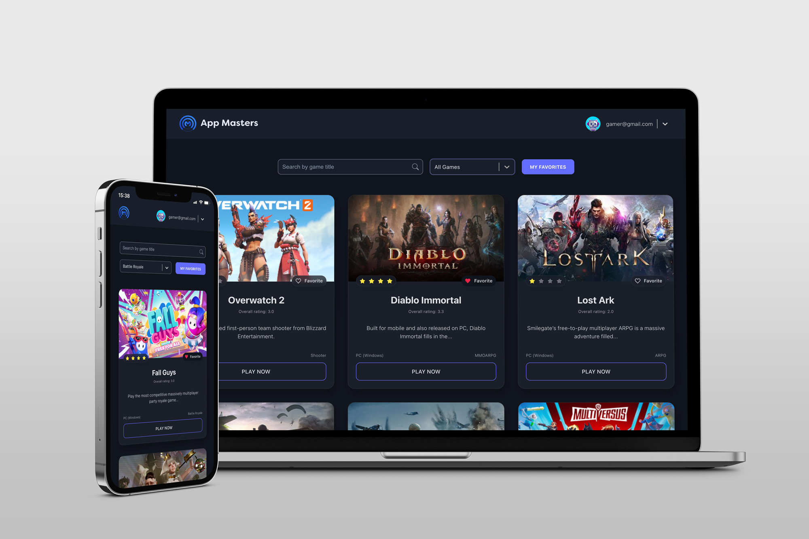

# Frontend AppMasters React Project

 

Live preview: [gwebsurfer.github.io/projeto-frontend-appmasters](https://gwebsurfer.github.io/projeto-frontend-appmasters)
## Description

This project is a React JS application that consumes an API to display a list of games, including a genre filter and a search field. It also includes the following features and requirements:

- [x] Task 1 - The project must be done using React or Next.js;
- [x] Task 2 - Retrieves the list of games from the /data endpoint;
- [x] Task 3 - Displays a loader while fetching the data;
- [x] Task 4 - Presents the games in three columns on larger screens;
- [x] Task 5 - Each game card includes the title and an image (at least);
- [x] Task 6 - Handles responsiveness to ensure a good display on desktops, tablets, and mobile devices;
- [x] Task 7 - When the API returns status codes 500, 502, 503, 504, 507, 508, or 509, displays the message "The server failed to respond. Please try reloading the page.";
- [x] Task 8 - For other API errors, displays the message "The server is currently unable to respond. Please try again later.";
- [x] Task 9 - Allows a maximum waiting time of 5 seconds for API responses. If the data takes longer to return, displays the message "The server took too long to respond. Please try again later.";
- [x] Task 10 - Hides the loader whenever displaying a message to the user or when the data is ready;
- [x] Task 11 - Includes a search field that allows users to locate games by their title (case-insensitive);
- [x] Task 12 - Once the data is available, the application identifies the genres returned and allows the user to select one of them to filter and display only games of the selected genre.

### Instructions

To run this project on your local machine, follow these steps:

1. Clone the repository to your local machine;
2. Navigate to the project directory using the command line;
3. Install the project dependencies by running the command: **npm i** or **npm install**.
4. Start the development server with the command: **npm run dev**.
5. Open your web browser and visit **http://localhost:5173** to access the application.

### Technologies

The technologies used in this project include:

-  React JS
-  HTML
-  CSS
-  JavaScript

---
:vulcan_salute: